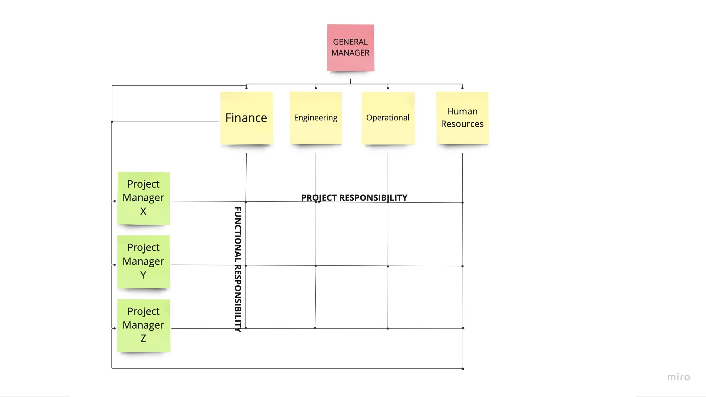
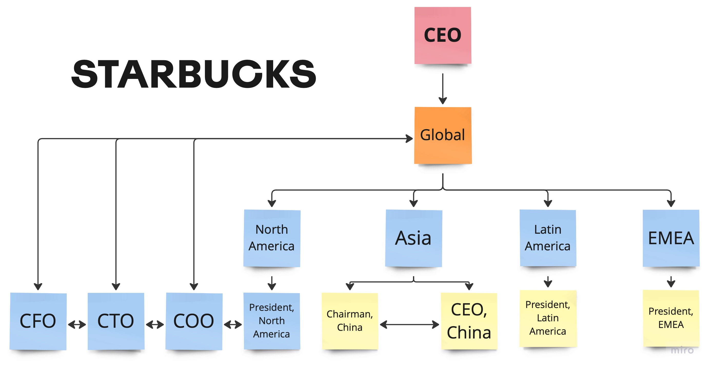

# MATRIX ORGANIZATION

## _By Sneha Shetty_
---

## What is an Organization Structure?

When employees know

_**what they’re responsible for**_ 

and 

_**who they report to.**_

---
### What are the various organizational structures we've discussed in class until now?
---
### 1. Holocratic
### 2. Hierarchical
### 3. Functional
### 4. Self-management
### 5. Agile
 
## Can you list any more?

---

## Let me introduce you to a Matrix Structure

---
# Originally it came to be known as the "TOYOTA SYSTEM"

---
### R&D - Functional
### Sales & Marketing - Functional
### Quality Control - Functional
### Supply Chain & Logistics - Functional 

# BUT
---
## Production Units

# DIVISIONAL

---
## This structure suited the Automative Industry 

---
## The same matrix concepts may not work for other industries.
---
## How does it work?

--- 
### 1. Functional Hierarchy

### 2. Geographic and Product-based Divisions

### 4. Teams

---

---
## Product Divisions

1. Coffee
2. Baked Goods
3. Merchandise
4. Evolution Fresh
5. Teavana
---

## Types of matrix structures

1. WEAK - Limited Authority

2. BALANCED - Equal Authority

3. STRONG - Most Authority

---
## Advantages of a matrix structure

### Clear Objectives 

###  Efficient use of resources

### Free-flowing information

### Training for project managers

### Retention of teams
---
## Disadvantages of a matrix structure

###  Complex reporting style 

###  Slow response time 

###  Conflicting guidance 

###  Potential power struggles 

###  Juggling priorities 
---
## When using the matrix structure makes sense?

Hiring new people to establish a dedicated project team is a costly endeavor, and many small businesses are already cash-strapped as is.

---
# _ THANK YOU FOR YOUR ATTENTION! _

