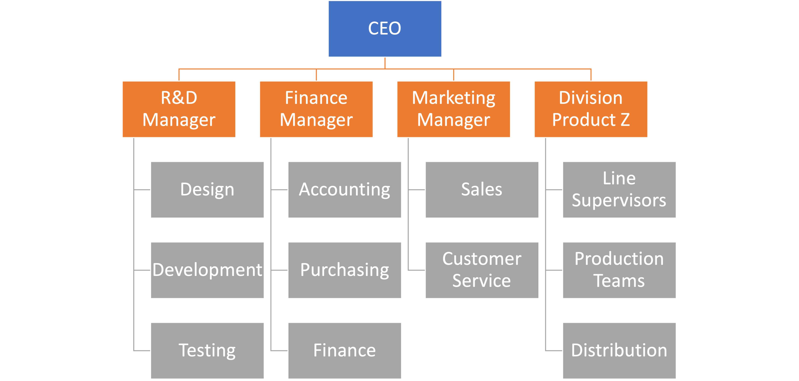
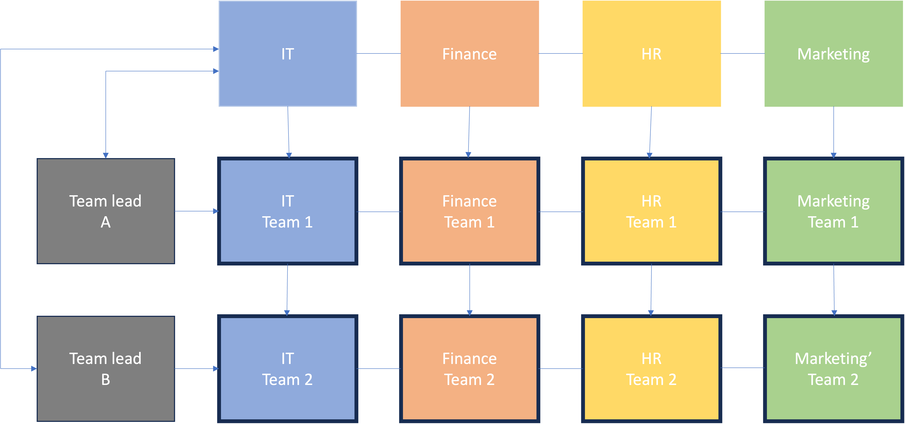

# Guide to the Matrix Organization Structure

_Summary:
A matrix organization is a company structure where teams report to multiple leaders. The matrix design keeps open communication between teams and can help companies create more innovative products and services. Using this structure prevents teams from needing to realign every time a new project begins._

How can you empower teams to move quickly on complex projects without getting bogged down by stakeholder reviews and approvals? Organizational structure may be the answer. Most work environments have chains of command in place so that everyone has clarity around decision-making authority. 

A hierarchical organizational chart has the chief executive officer at the top. The chief operating officer and the chief financial officer are right below them. Department managers then branch off from the top leadership roles, with project managers branching off from there.

A matrix organization differs from this classic structure since team members report to both a project manager and a department lead. In the guide below, we’ll discuss what a matrix organization is and how you can use one for complex projects. 

 

## What is a matrix organization?

A matrix organization is a work structure where team members report to multiple leaders. In a matrix organization, team members (whether remote or in-house) report to a project manager as well as their department head. This management structure can help your company create new products and services without realigning teams.

## How do matrix organizations work?

The matrix organizational or management structure works by grouping employees and resources by function and by product or project. An employee from the design department may be assigned to a project team -- IT Project Sandpaper, for example -- and would have to report to two bosses, or more, depending on the number of projects they’re assigned to at any given time: Project Sandpaper’s project manager and the design department head.
The matrix is temporary in nature and is designed to last only for the duration of a project.

## Why to use a Matrix Organization?

The matrix organizational structure is more complex than the hierarchical structure, but it has many advantages. Some advantages of the matrix design include clear project objectives, an efficient use of resources, free-flowing information, and training for project managers. 
1. Clear project objectives
 - The matrix organization design can ensure greater clarity on project objectives. When your team reports their progress to both the project manager and the department head, solidifying project goals is critical. When the project manager feels supported by other members of senior management, project organization becomes a priority.
 
 - Scenario: Let’s say your team is working on an app development project. Because you’re using a matrix structure, the IT developers report to you as the project manager and the IT department head. The project objective is to create a keyword search app for marketers to use on-the-go. When the IT department head and the project manager communicate a clear project objective to the IT developers, the app gets developed quicker. 

2. Efficient use of resources
- The matrix structure allows for an efficient use of resources because teams include specialists from various departments. This reduces overhead costs and the amount of time needed to complete a project. In a hierarchical structure where every team reports to only one manager, there are fewer managers per team. These teams may require more time to create one project deliverable because they don’t have members with different specialities.

- Scenario: The team creating the keyword research app may involve specialists from the IT department, the finance department, and the marketing department. When these team members successfully report to their department heads and their project manager, they increase team productivity, save time, and get the project done more efficiently. 

- The matrix team reduces costs because without a combined group of specialists, companies would have to restructure teams and potentially hire new team members every time a new product or service is developed. 

3. Free-flowing information
- Working in a matrix structure creates a free-flow of information between teams because the team reports to multiple leaders. While team members must remember to relay information in a hierarchical system, the matrix makes information flow a requirement. Reporting information to multiple leaders may seem tedious, but with the right project management system in place, it requires little or no extra work from team members. 

- Scenario: If the development team on the keyword research app only reported to the project manager, information about a bug fix could get lost. However, relaying information to the IT department head is easy to remember when it’s part of the matrix process. 

 

4. Training for project managers
- The unique structure of the matrix organization gives project managers a large amount of responsibility. Project managers must lead their team through the project lifecycle. This structure challenges project managers and trains those who want to be cross-functional managers in other departments.

- Scenario: During this project, your team encounters some bug fixes and a delay in the project timeline. As the project manager, it’s your responsibility to work with the IT department head to successfully handle all issues. In doing so, you discover a personal interest in IT—and a potential career opportunity in the future. 

5. Team retention
- The matrix organization has a great track record from team member retention because when specialists are placed together, the product team stays strong. These team members work under functional department heads and are then assigned to project managers. Specialists often enjoy working together, and it can improve project performance. 

- Scenario: During the keyword research app project, the project team consists of various IT, marketing, and finance specialists because these team members understand the ins and outs of creating an application for phone users. This team of specialists will likely stick together to work on many projects in the future.

## When using the matrix structure makes sense?

Hiring new people to establish a dedicated project team is a costly endeavor, and many small businesses are already cash-strapped as is.

Matrix management enables companies with tight purse strings to maximize whatever resources they already have. It lets you share resources and employees across functions to develop new products or solutions, helping you create a stronger, more diverse project team in the process.

## Types of Matrix Management

There are three types of matrix management, with each type giving more or less authority to the project manager. You can visualize these management types on a scale with the project manager on one end and the department manager on the other. 

### Weak matrix

In a weak matrix, the project manager has the least amount of decision-making power compared to the other matrix management types. When the project manager has limited authority over the project, the matrix becomes weak because the project budget and timeline is in the hands of the department head. Creating a communication plan can keep communication from getting lost in a weak matrix. 

### Balanced matrix
In a balanced matrix, the department head and the project manager have equal authority and team members report to both of them. This keeps communication open between everyone in leadership roles and allows the project to move forward smoothly. 

### Strong matrix
In a strong matrix, the project manager has most of the decision-making power over the project, while the department head has more limited authority. This creates a strong organizational structure because the project manager has full ownership over the project. The department head can oversee the project but doesn’t make key decisions.

# Making the matrix structure work for your needs

The matrix organizational structure has its uses and drawbacks. It allows for the efficient use of limited resources, but it’s not the answer to every situation. If the required tools, processes, and principles are not implemented correctly, things can get complicated really fast.
Because employees need to report to at least two managers, the right amount of communication and active participation is crucial for success.